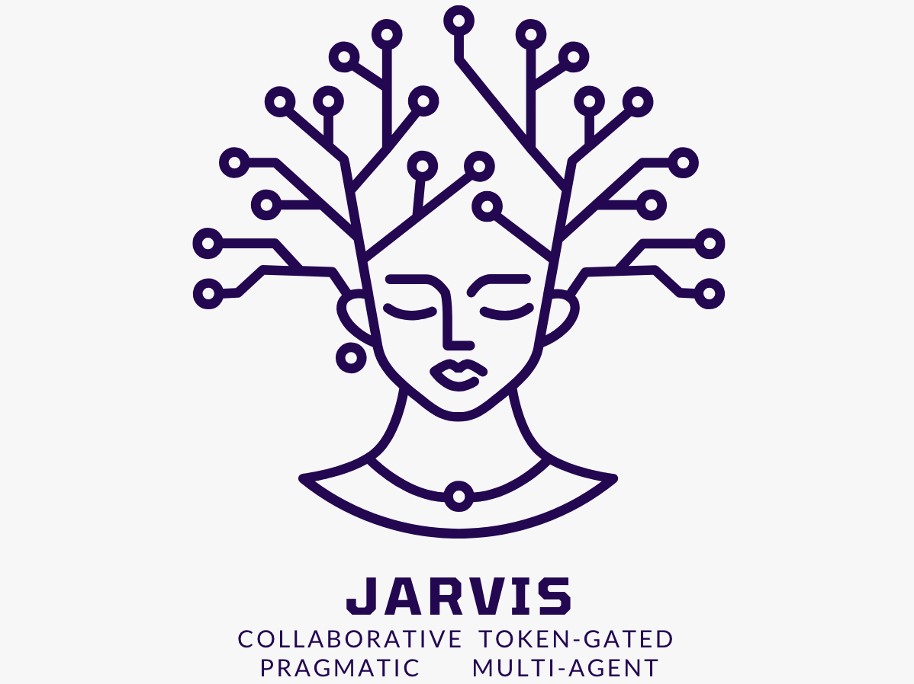

- Collaborative: meant for teams (eg traders)
- Token-Gated: only the owner of the Jarvis NFT are granted access
- Pragmatic: can build ready-to-go transaction from the user's intent
- Multi-Agent: combines many agents (potentially an infinite number of agents) to get the most powerful AI assistant ever

## Getting Started
### Prepare
Install dependencies
```shell
npm install
```

### Testing Locally
Create `.env` file and add your Brian API Key
```shell
cp .env.local .env
```

Include all your secrets `.env` file replace `YOUR_BRIAN_KEY` with your API Key. Check the Brian API docs here https://docs.brianknows.org/brian-api-beta/apis/agent-apis
```text
BRIAN_API_KEY="YOUR_BRIAN_KEY"
```

Build your Agent
```shell
npm run build
```

Test your Agent locally
```shell
npm run test
```

Expected Test Results
```shell

INPUT: {"method":"GET","path":"/ipfs/QmVHbLYhhYA5z6yKpQr4JWr3D54EhbSsh7e7BFAAyrkkMf","queries":{"chatQuery":["What is Uniswap?"]},"secret":{"brianApiKey":"brian_xNVZeeA6mH1fuHIx1"},"headers":{}}
GET RESULT: {
  status: 200,
  body: '\n' +
    '    <!DOCTYPE html>\n' +
    '    <html lang="en">\n' +
    '        <head>\n' +
    '            <meta charset="utf-8" />\n' +
    '            <title>AI Agent Contract Demo UI</title>\n' +
    '        </head>\n' +
    '        <body>\n' +
    '            <div align="center">\n' +
    '                <p>"Brian AI Agent Contract hosted on <a href="https://github.com/Phala-Network/ai-agent-template-brian">Phala Network</a>, an AI Coprocessor for hosting AI Agents."</p>\n' +
    '                \n' +
    '                <p>"Overview:\n' +
    'Uniswap is a decentralized finance (DeFi) protocol that allows users to swap various Ethereum-based tokens without the need for intermediaries or order books. It operates on the Ethereum blockchain and uses automated smart contracts to facilitate token exchanges.\n' +
    '\n' +
    'The Uniswap Protocol:\n' +
    'At the core of Uniswap is an automated liquidity protocol that enables users to trade tokens directly from their wallets. Liquidity providers contribute tokens to various pools, which are then used to facilitate trades. These providers earn fees on trades executed through the protocol, proportional to their share of the liquidity pool.\n' +
    '\n' +
    'Swaps:\n' +
    "The primary function of Uniswap is token swaps, where users can exchange one ERC-20 token for another directly on the platform. This process is fast, efficient, and does not require centralized exchanges or counterparties. Uniswap's automated market maker (AMM) system ensures that trades are always executed at fair market prices based on the available liquidity in the pool.\n" +
    '\n' +
    'Glossary:\n' +
    "To better understand Uniswap and its features, it's helpful to familiarize yourself with some key terms commonly used in the protocol. Some important terms include liquidity provider, automated market maker (AMM), liquidity pool, slippage, and impermanent loss. Having a solid grasp of these concepts will enhance your ability to navigate and utilize Uniswap effectively.\n" +
    '\n' +
    'In conclusion, Uniswap is a groundbreaking DeFi protocol that has revolutionized the way users trade tokens on the Ethereum blockchain. By leveraging automated smart contracts and decentralized liquidity pools, Uniswap provides a seamless and efficient trading experience for users looking to swap tokens in a decentralized manner."</p>\n' +
    '            </div>\n' +
    '        </body>\n' +
    '    </html>',
  headers: {
    'Content-Type': 'text/html; charset=UTF-8',
    'Access-Control-Allow-Origin': '*'
  }
}
INPUT: {"method":"POST","path":"/ipfs/QmVHbLYhhYA5z6yKpQr4JWr3D54EhbSsh7e7BFAAyrkkMf","queries":{"chatQuery":["What is Uniswap?"]},"secret":{"brianApiKey":"brian_xNVZeeA6mH1fuHIx1"},"headers":{},"body":"{\"untrustedData\":{\"fid\":2,\"url\":\"https://fcpolls.com/polls/1\",\"messageHash\":\"0xd2b1ddc6c88e865a33cb1a565e0058d757042974\",\"timestamp\":1706243218,\"network\":1,\"buttonIndex\":2,\"castId\":{\"fid\":226,\"hash\":\"0xa48dd46161d8e57725f5e26e34ec19c13ff7f3b9\"}},\"trustedData\":{\"messageBytes\":\"d2b1ddc6c88e865a33cb1a565e0058d757042974...\"}}"}
POST RESULT: {
  status: 200,
  body: 'Not Implemented',
  headers: {
    'Content-Type': 'text/html; charset=UTF-8',
    'Access-Control-Allow-Origin': '*'
  }
}

To test in the SideVM playground go to https://phat.phala.network/contracts/view/0xf0a398600f02ea9b47a86c59aed61387e450e2a99cb8b921cd1d46f734e45409

Connect you polkadot.js account and select 'run_js' with the parameters:
- engine: SidevmQuickJSWithPolyfill
- js_code: Source code text of dist/index.ts
- args: {"method":"GET","path":"/ipfs/QmVHbLYhhYA5z6yKpQr4JWr3D54EhbSsh7e7BFAAyrkkMf","queries":{"chatQuery":["What is Uniswap?"]},"secret":{"brianApiKey":"BRIAN_API_KEY"},"headers":{}}
Watch video here for to see the visual steps of testing in Sidevm playground: https://www.youtube.com/watch?v=fNqNeLfFFME

Make sure to replace queries and secret with your values compatible with your AI Agent Contract.
```

### Publish Your AI Agent
Upload your compiled AI Agent code to IPFS using `thirdweb`.
```shell
npm run publish-agent
```
or (if the previous method fails) you could alternatively use `CURL`:
```shell
curl -F file=@./dist/index.js https://agents.phala.network/ipfs
```

Upon a successful upload, the command should show the URL to access your AI Agent.
```shell
> phat-gpt-template@0.0.1 publish-agent
> phat-fn build --experimentalAsync && tsx scripts/publish.ts

✓ Compiled successfully.
  72.73 KB  dist/index.js

    $$\     $$\       $$\                 $$\                         $$\       
    $$ |    $$ |      \__|                $$ |                        $$ |      
  $$$$$$\   $$$$$$$\  $$\  $$$$$$\   $$$$$$$ |$$\  $$\  $$\  $$$$$$\  $$$$$$$\  
  \_$$  _|  $$  __$$\ $$ |$$  __$$\ $$  __$$ |$$ | $$ | $$ |$$  __$$\ $$  __$$\ 
    $$ |    $$ |  $$ |$$ |$$ |  \__|$$ /  $$ |$$ | $$ | $$ |$$$$$$$$ |$$ |  $$ |
    $$ |$$\ $$ |  $$ |$$ |$$ |      $$ |  $$ |$$ | $$ | $$ |$$   ____|$$ |  $$ |
    \$$$$  |$$ |  $$ |$$ |$$ |      \$$$$$$$ |\$$$$$\$$$$  |\$$$$$$$\ $$$$$$$  |
     \____/ \__|  \__|\__|\__|       \_______| \_____\____/  \_______|\_______/ 

 💎 thirdweb v0.14.12 💎

- Uploading file to IPFS. This may take a while depending on file sizes.

✔ Successfully uploaded file to IPFS.
✔ Files stored at the following IPFS URI: ipfs://QmayeZxHXwJxABXaNshP6j8uBE6RedkhmEgiaXd1w1Jib3
✔ Open this link to view your upload: https://bafybeif3y2jpswse2n6s2cikwyjmbak4cxlpm6vrmgobqkgsmmn34l6m4i.ipfs.cf-ipfs.com/

AI Agent Contract deployed at: https://agents.phala.network/ipfs/QmayeZxHXwJxABXaNshP6j8uBE6RedkhmEgiaXd1w1Jib3

Make sure to add your secrets to ensure your AI-Agent works properly.
```

### Access the Published AI Agent

Once published, your AI Agent is available at the URL: `https://agents.phala.network/ipfs/<your-cid>`. You can get it from the "Publish to IPFS" step.

You can test it with `curl`.

```bash
curl https://agents.phala.network/ipfs/<your-cid>
```

### Add Secrets

By default, all the compiled JS code is visible for anyone to view if they look at IPFS CID. This makes private info like API keys, signer keys, etc. vulnerable to be stolen. To protect devs from leaking keys, we have added a field called `secret` in the `Request` object. It allows you to store secrets in a vault for your AI Agent to access.

<details>
<summary><b>How to Add Secrets</b></summary>

The steps to add a `secret` is simple. We will add the [Brian](https://www.brianknows.org/app/) API Key in this example by creating a secret JSON object with the `brianApiKey`:

```json
{"brianApiKey": "<BRIAN_API_KEY>"}
```

Then in your frame code, you will be able to access the secret key via `req.secret` object:

```js
async function POST(req: Request): Promise<Response> {
    const apiKey = req.secret?.apiKey
}
```

> **Note**: Before continuing, make sure to publish your compiled AI Agent JS code, so you can add secrets to the CID.

**Open terminal**
Use `curl` to `POST` your secrets to `https://agents.phala.network/vaults`. Replace `IPFS_CID` with the CID to the compile JS code in IPFS, and replace `<BRIAN_API_KEY>` with your Brian API key. Note that you can name the secret field name something other than `brianApiKey`, but you will need to access the key in your `index.ts` file with the syntax `req.secret?.<your-secret-field-name> as string`

The command will look like this:
```shell
curl https://agents.phala.network/vaults -H 'Content-Type: application/json' -d '{"cid": "IPFS_CID", "data": {"brianApiKey": "<BRIAN_API_KEY>"}}'
# Output:
# {"token":"e85ae53d2ba4ca8d","key":"e781ef31210e0362","succeed":true}
```

The API returns a `token` and a `key`. The `key` is the id of your secret. It can be used to specify which secret you are going to pass to your frame. The `token` can be used by the developer to access the raw secret. You should never leak the `token`.

To verify the secret, run the following command where `key` and `token` are replaced with the values from adding your `secret` to the vault.
```shell
curl https://agents.phala.network/vaults/<key>/<token>
```

Expected output:
```shell
{"data":{"brianApiKey":"<BRIAN_API_KEY>"},"succeed":true}
```

If you are using secrets, make sure that your URL is set in the following syntax where `cid` is the IPFS CID of your compiled JS file and `key` is the `key` from adding secrets to your vault.
```text
https://agents.phala.network/ipfs/<cid>?key=<key>
```

Example:
https://agents.phala.network/ipfs/QmX5ofLpppdaFuuZx3LvGaAZAXz7zuD6gy5AuzE6cyoz4N?key=2e01c25ca431c806&chatQuery=What%20is%20Uniswap

</details>

### Access Queries
To help create custom logic, we have an array variable named `queries` that can be accessed in the `Request` class. To access the `queries` array variable `chatQuery` value at index `0`, the syntax will look as follows:
```typescript
const query = req.queries.chatQuery[0] as string;
```
The example at https://agents.phala.network/ipfs/QmX5ofLpppdaFuuZx3LvGaAZAXz7zuD6gy5AuzE6cyoz4N?key=2e01c25ca431c806&chatQuery=What%20is%20Uniswap will have a value of `When did humans land on the moon`. `queries` can have any field name, so `chatQuery` is just an example of a field name and not a mandatory name, but remember to update your `index.ts` file logic to use your expected field name.

## Useful Curl Commands
`curl https://agents.phala.network/vaults -H 'Content-Type: application/json' -d '{"cid": "QmWTXjtJJUQKacRD2x4Dxj2ysKoo2PKMrSBwV2PBTRuUv6/0", "data": {"brianApiKey": "brian_key"}}'`

`curl https://agents.phala.network/ipfs/QmWTXjtJJUQKacRD2x4Dxj2ysKoo2PKMrSBwV2PBTRuUv6/0\?key\=the_key_from_previous_call`